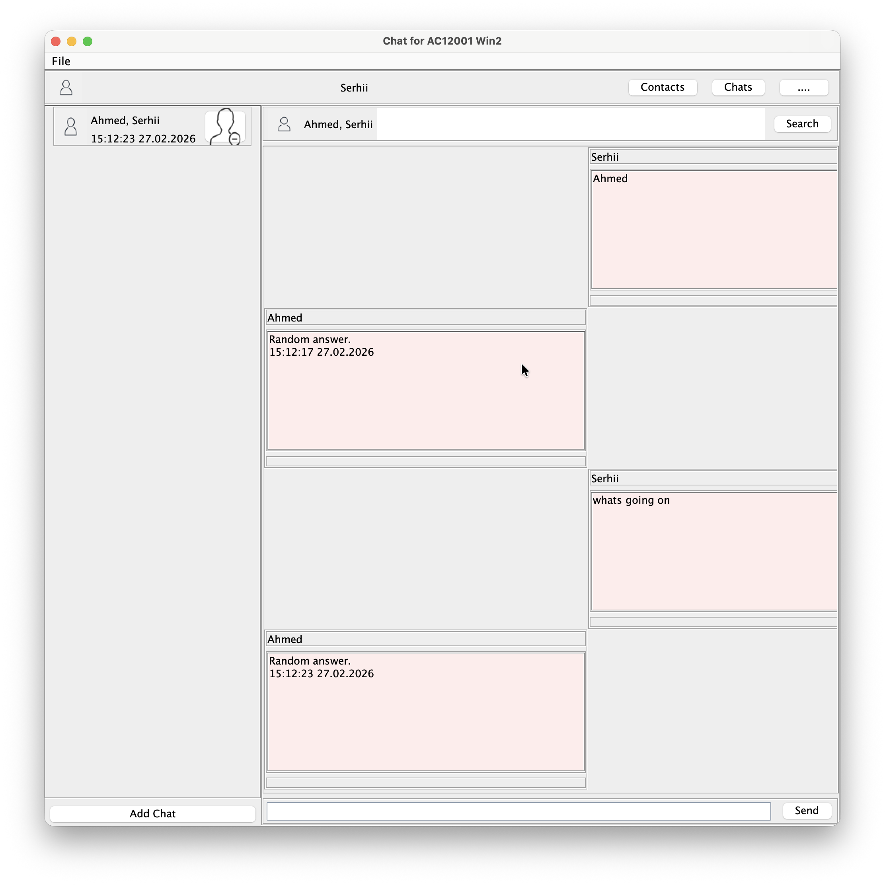

# Java Messaging Application 💬

A feature-rich desktop messaging application built with Java Swing. Supports individual and group chats, contact management, message reactions, emoji, and persistent data storage across sessions — all implemented without external messaging libraries or network dependencies.

## 📸 Screenshots

| Chat View | Contacts | 
|---|---|
|  |  |

## 🧠 Tech Stack

- **Java (Swing)** — Desktop GUI with custom-styled components
- **Java AWT** — Graphics utilities and custom rendering
- **Java Serialization** — Data persistence across sessions
- **Design Patterns** — MVC architecture, Observer pattern (PropertyChangeListener)

## ✨ Features

### Messaging
- Individual and group chats with multiple contacts
- Timestamped message history with scrollable interface
- Read/unread status indicators
- Like/dislike reactions on messages
- Integrated emoji picker

### Contacts
- Add, remove, and manage contacts with profile images
- Alphabetically sorted contact list
- Recent conversation previews (last 3 messages per contact)
- Custom or default profile pictures

### Data & Sessions
- Full session persistence — conversations and contacts survive application restarts
- File serialisation stores all user data locally
- Seamless resume from previous session on launch

### UI
- Clean, modern interface with custom-styled Swing components
- Bottom navigation panel switching between Contacts, Chats, and User Info
- Responsive panels that adapt to window resizing
- Custom dialogs for creating contacts and group chats

## 🏗️ Architecture

```
java-messaging-application/
└── src/
    ├── Main.java                    # Entry point
    ├── MainWindow.java              # Primary GUI controller (MVC)
    ├── BackendImplementation.java   # Business logic layer
    ├── User.java                    # Extends Contact; manages chats and persistence
    ├── Contact.java                 # Profile info and message history
    ├── Chat.java                    # Group conversation management
    ├── Message.java                 # Message content, metadata, reactions
    ├── MessageCard.java             # Custom message UI component
    ├── ContactCard.java             # Custom contact UI component
    ├── ChatCard.java                # Custom chat UI component
    ├── ChatsPanel.java              # Chats view
    ├── ContactsPanel.java           # Contacts view
    ├── MessagesPanel.java           # Messages view
    ├── GraphicsUtils.java           # Rendering helpers
    └── JFlatButton.java             # Custom modern button component
```

## 🧪 How to Run

### Prerequisites
- JDK 8 or higher
- Any Java IDE (IntelliJ IDEA, Eclipse, NetBeans) or command line

### Command Line

```bash
git clone https://github.com/AhmedIkram05/java-messaging-application.git
cd java-messaging-application/src
javac *.java
java Main
```

### IDE
1. Open the project and mark `src/` as the source root
2. Run `Main.java`

On first launch the app creates a default user profile. Use the bottom navigation to switch between Contacts, Chats, and User Info panels.
